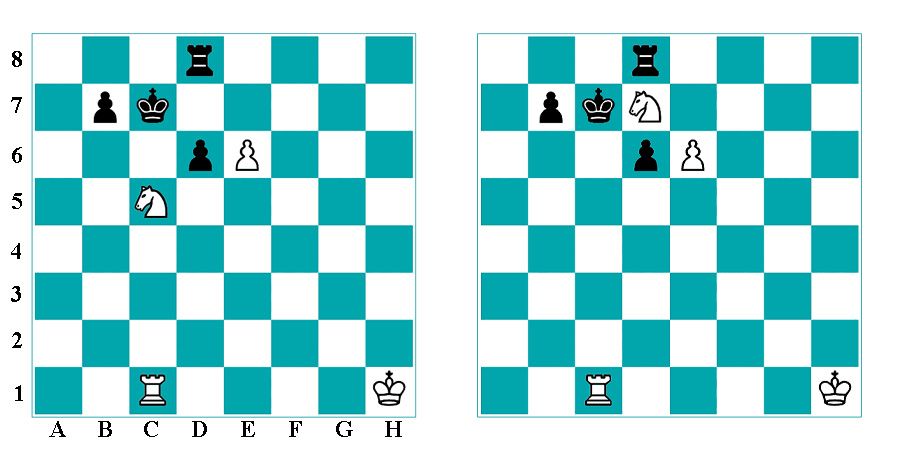
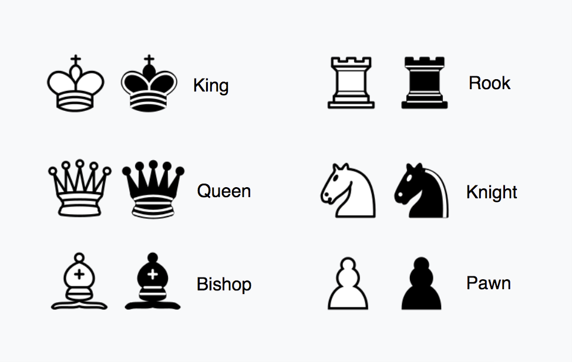

# Robocontest Chess masalasi
[Masala](https://robocontest.uz/tasks/0847) | To'liq yechim hali tayyormas
## Masala shartlari
>King(shox) - K\
Queen(farzin) - Q\
Bishop(fil) - B\
Knight(ot) - N\
Rook(rux) - R\
Pawn(piyoda) - P

>Oq - katta harflar\
Qora - kichik harflar\
k = 0 -> qora\
k = 1 -> oq
## Har bitta toshni qayerga yura olishini topish

### Adashib ketmaslik uchun shaxmat toshlarini inglizcha nomlari
Muhim: Masalada har bitta toshni inglizchadagi bosh harfi beriladi lekin ot bunda istisno. King (Shox) va Knight (Ot) ning bosh harflari bir xil bo'lgani uchun ot N harfi bilan belgilanadi



### Toshlar yura oladigan kataklari uchun formula
>x va y mos ravishda harfni tartib raqami va son\
Masalan: C5 bo'lsa C ni tartib raqami 3 unda x = 3 va y = 5 bo'ladi\

>x ni qo'shish va ayirishda harfni tartib raqami qo'shiladi va tartib raqami orqali yangi harfga o'zgaradi\
Masalan: D2 dagi D ni tartib raqami 4, unga 1 ni qo'shsak 5 va tartib raqami 5 ga teng harf E ga o'zgaradi

>n - ixtiyoriy son


**Pawn (Piyoda)**\
(x)(y+1)\
(x)(y+2)

**Rook (Rux)**\
(x+n)(y)\
(x)(y+n)

**Bishop (Fil)**\
(x+n)(y+n)\
(x+n)(y-n)\
(x-n)(y+n)\
(x-n)(y-n)

**Queen (Farzin)**\
(x+n)(y+n)\
(x+n)(y-n)\
(x-n)(y+n)\
(x-n)(y-n)\
(x+n)(y)\
(x)(y+n)

**King (Shox)**\
(x+1)(y)\
(x-1)(y)\
(x)(y+1)\
(x)(y-1)\
(x+1)(y+1)\
(x+1)(y-1)\
(x-1)(y+1)
\(x-1)(y-1)

**Knight (Ot)**\
(x+1)(y+2)\
(x+1)(y-2)\
(x-1)(y+2)\
(x-1)(y-2)\
(x+2)(y+1)\
(x+2)(y-1)\
(x-2)(y+1)\
(x-2)(y-1)

## Shaxmat taxtasini lug'atga yuklash
Quyidagi kodni qulay deb hisoblayman, chunki lug'atga katak koordinatasi berish orqali qaysi tosh turganini yoki bo'shligini oson bilish mumkin.

```python
k = int(input())
board = dict()

for i in range(8, 0, -1):
    qw = input()
    board[f"A{i}"] = qw[0]
    board[f"B{i}"] = qw[1]
    board[f"C{i}"] = qw[2]
    board[f"D{i}"] = qw[3]
    board[f"E{i}"] = qw[4]
    board[f"F{i}"] = qw[5]
    board[f"G{i}"] = qw[6]
    board[f"H{i}"] = qw[7]
```

## Algoritm
- Qaysi toshni joyini o'zgartirsak boshqa tosh shox beradigan toshni topish
- Agar unaqasi bo'lmasa har bitta toshni yursa bo'ladigan kataklarini topib orasidan shox beradiganini topish
- Shox bergandan keyin shoxni qochishi mumkinligini tekshirish
- Agar qocholsa qaytadan boshqa toshni tanlash

### Hozircha faqat shu
Agar savol va takliflar bo'lsa iltimos "Discussions" bo'limida qoldiring
